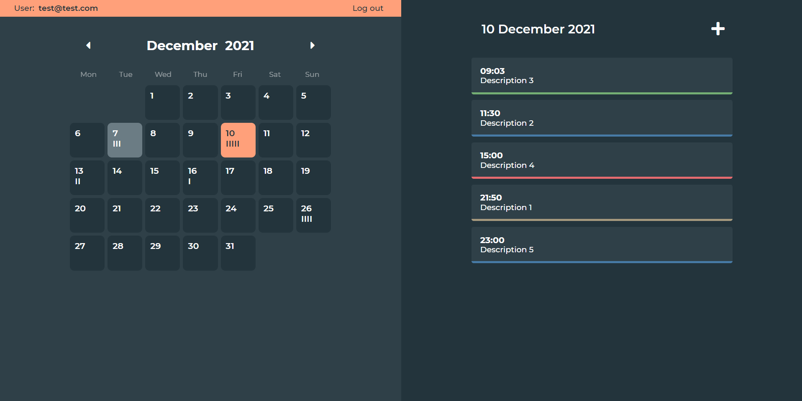

# Calendar

Web application that allows users to keep track of their calendar events. Frontend implemented in JavaScript, HTML5 and CSS3. Backend implemented in Python (Flask).

Deployed on [PythonAnywhere](https://calendar.eu.pythonanywhere.com/).

